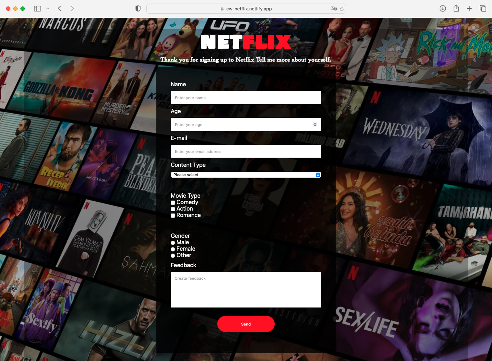

## Project : Netflix Page

## Description

Project aims to create google landing page.

## Project Skeleton

```
google-landing-page (folder)
Sass Camping Website Design (folder)
|
|----readme.md         # Definition of the project
|----images            # Images of the project
|----solution
        |----index.html
        |----style.css

```

## Outcome

🔗 [Netflix Page](https://cw-netflix.netlify.app/)

<br>



### The following issues are covered in the project;

- HTML
- Css
  - List Properties-Tables
  - The Display Property
  - The position Property
  - The Float Property
  - Opacity / Transparency
  - Units in CSS
  - CSS Setting height and width
  - CSS Outline
  - CSS Combinators

## Resources

- [Images](./img/)
